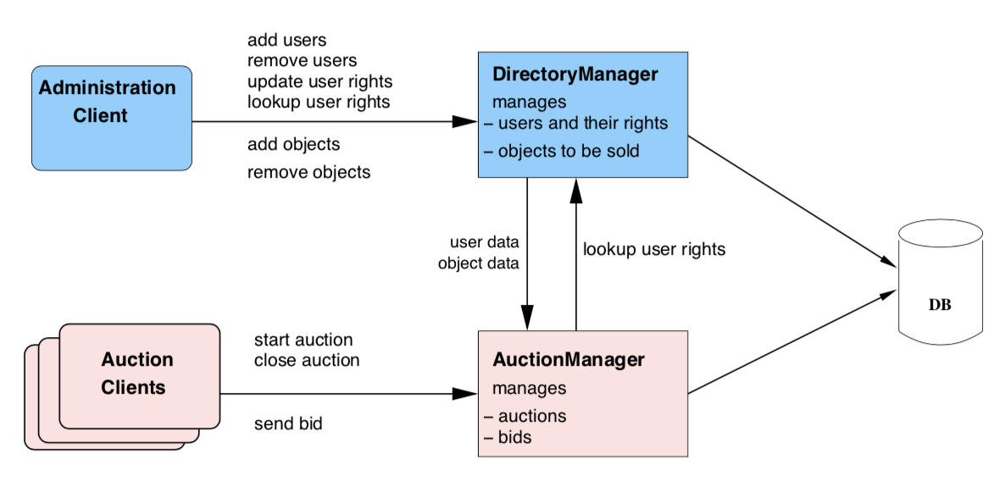
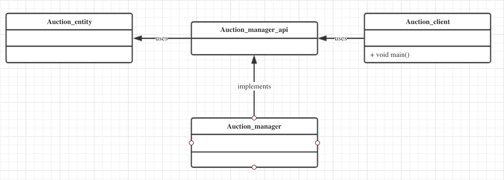
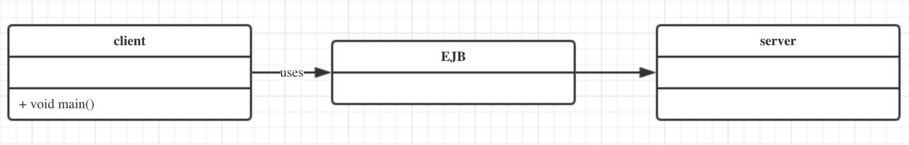
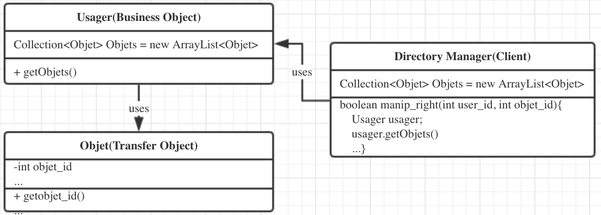
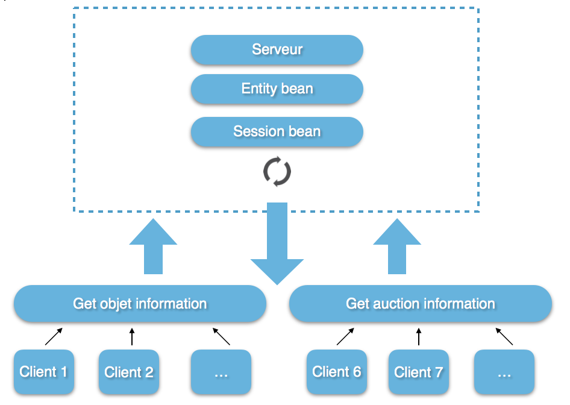

### Introduction

The aim of the project is to design and implement an **auction (bidding) system** to get familar with the J2EE techniques and some classical design patterns. 

The auction system allows users to register and propose objects for sale. Users may also bid on objets proposed by other users. When an object is proposed for auction, the vendor indicates a starting price, the maximum duration of the bidding process and possibly the increment for automatic bidding (for instance 0.1, 0.5, 1, 2, 5 or 10 Euros).


### Running the demo 

Lauch the program:

- ```./runcmd.sh```

The default admin passwork: *admin*, the symplify the execution, we hard-coded a predefined scenario into the program. The readers can feel free to adapt the application to make it more user-friendy.


### Architecture design

The general Architecture of the system is presented in the following figure. It follows a client/server architecture. Clients and servers are distributed over the network



- A **Directory Manager** manages the users and the objects proposed for auctions.
- An **Administration Client** accesses **the Directory Manager services** to 
  - add and remove users;
  - manage the rights of the users;
  - to add and remove objects to be proposed for auction by a user
- An **Auction Manager** manages 
  - the auctions for objects proposed to be sold
  - the bids on objects users want to buy.
- An (several) **Auction Client**(s) accesses **the Auction Manager services**. 


### Some technologies involved in the project 

- Maven, Junit Test
- EJB 3.2: statefule session bean
- EclipseLink (JPA) + JPQL: *EclipseLink* is a JPA framework like Hibernate 
- Glassfish, Derby


### Security Measures

- SQL Injection
- Authentification mecanism


### Design Patterns

- DAO Pattern

  


- Proxy Pattern

  


- Transfer Object Pattern 

  


- Asynchrous Pattern

  

  

  
